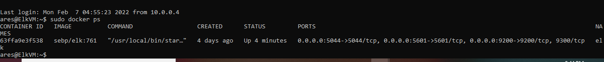

## Automated ELK Stack Deployment

The files in this repository were used to configure the network depicted below.

These files have been tested and used to generate a live ELK deployment on Azure. They can be used to either recreate the entire deployment pictured above. Alternatively, select portions of the YAML file may be used to install only certain pieces of it, such as Filebeat.

  - [install-elk.yml](https://github.com/Jessicabrownsugar/Elk_stack_Project/blob/main/Ansible/install-elk.yml.txt)
  - [metricbeat-playbook.yml](https://github.com/Jessicabrownsugar/Elk_stack_Project/blob/main/Ansible/Metricbeat-Playbook.yml.txt)
  - [filebeat-playbook.yml](https://github.com/Jessicabrownsugar/Elk_stack_Project/blob/main/Ansible/filebeat-playbook.yml.txt)

This document contains the following details:
- Description of the Topology
- Access Policies
- ELK Configuration
  - Beats in Use
  - Machines Being Monitored
- How to Use the Ansible Build

### Description of the Topology

The main purpose of this network is to expose a load-balanced and monitored instance of DVWA, the D*mn Vulnerable Web Application.

Load balancing ensures that the application will be highly available, in addition to restricting access to the network.
- The off-loading function of a load balancer defends an organization against distributed denial-of-service (DDoS) attacks.  
- The advantage of having jumpbox is that it  prevents all Azure VM’s to be exposed to the public. By using the network security group, we can restrict the IP addresses to communicate with it.

Integrating an ELK server allows users to easily monitor the vulnerable VMs for changes to the data and system logs.
- Filebeat monitors the log files or locations that you specify, collects log events, and forwards them either to Elasticsearch or Logstash for indexing.
- Metricbeat helps you monitor your servers by collecting metrics from the system and services running on the server.

The configuration details of each machine may be found below.
_Note: Use the [Markdown Table Generator](http://www.tablesgenerator.com/markdown_tables) to add/remove values from the table_.

| Name     | Function | IP Address | Operating System |
|----------|----------|------------|------------------|
| Jump Box | Gateway  | 10.0.0.4| Linux            |
| Web 1     |  Webserver | 10.0.0.9   | Linux          |
| Web 2     | Webserver | 10.0.0.10    |   Linux         |
| Web 3    |  Webserver |  10.0.0.11    | Linux          |
| Elk Server| Monitoring| 10.1.0.4| Linux|
### Access Policies

The machines on the internal network are not exposed to the public Internet. 

Only the jumpbox provisioner machine can accept connections from the Internet. Access to this machine is only allowed from the following IP addresses:
- my local IP Address

Machines within the network can only be accessed by the jumpbox provisioner.
-My local machine can only access the ELK VM.

A summary of the access policies in place can be found in the table below.

| Name     | Publicly Accessible | Allowed IP Addresses |
|----------|---------------------|----------------------|
| Jump Box | Yes             | My IP Address   |
|  Web 1     |      No       |     10.1.0.4         |
|    Web 2   |  No          |      10.1.0.4        |
|Web 3	| No	|	10.1.0.4|
| Elk Server| No| 10.1.0.4|

### Elk Configuration

Ansible was used to automate configuration of the ELK machine. No configuration was performed manually, which is advantageous because
-  it can be ran from the command line without configuration files for simple tasks, such as making sure a service is running, or to trigger updates or reboots.

The playbook implements the following tasks:

- Installs docker.io
- Installs pip3
- Installs Docker Python Module
- Increases virtual memory
- Downloads and launches a docker

The following screenshot displays the result of running `docker ps` after successfully configuring the ELK instance.

### Target Machines & Beats
This ELK server is configured to monitor the following machines:

| Name     |IP Addresses |
|----------|---------------------|
|  Web 1     |     10.0.0.9       |
|    Web 2|     10.0.0.10             |
|Web 3	|	10.0.0.11|

We have installed the following Beats on these machines:
- Web 1, Web 2, Web 3, Elk Server
- The ELK Stack Installed are: FileBeat and MetricBeat

These Beats allow us to collect the following information from each machine:
- Filebeat - collects data about the file system
- Metricbeat - collects machine metrics and system statistics

### Using the Playbook
In order to use the playbook, you will need to have an Ansible control node already configured. Assuming you have such a control node provisioned: 

SSH into the control node and follow the steps below:

- Copy the playbook file to Ansible .
- Update the hosts file to include webserver and elk. Edit hosts file to update and to make Ansible run the playbook on a specific machine, and specify which machine to install the ELK server on versus which to install Filebeat.
- Run the playbook, and navigate to Kibana to check that the installation worked as expected.

- _Which file is the playbook? Where do you copy it?_
	The playbook file would be the YAML file that is provided. And it should be copied into the /etc/ansible directiory in the ansible container.

- _Which file do you update to make Ansible run the playbook on a specific machine? How do you specify which machine to install the ELK server on versus which to install Filebeat on?
	The hosts file should be updated in order to run the playbook on a specific machine. 
	You can specify which machine to use by adding the private IP Addresses of the machines wish to install ELK or Filebeat on.

Add the following to your hosts file:

[webservers]
[your.VM.IP] ansible_python_interpreter=/usr/bin/python3	
[your.VM.IP] ansible_python_interpreter=/usr/bin/python3

[elk]
[your_VM_IP] ansible_python_interpreter=/usr/bin/python3

- _Which URL do you navigate to in order to check that the ELK server is running?

http://[your.VM.IP]:5601/app/kibana

_As a **Bonus**, provide the specific commands the user will need to run to download the playbook, update the files, etc._